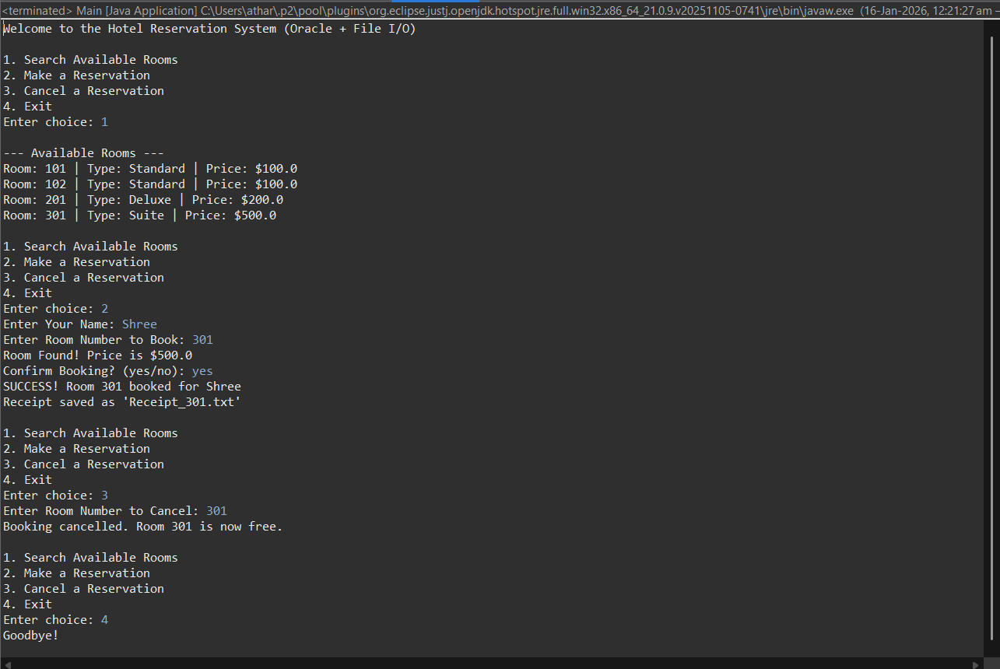
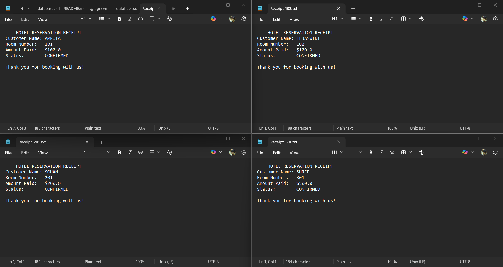

# 🏨 Hotel Reservation System

A console-based Java application to manage hotel bookings, room availability, and customer data. This project demonstrates Object-Oriented Programming (OOP) principles, Database Connectivity (JDBC), and File I/O for generating receipts.

## 🚀 Features
* **Search Rooms:** View available rooms dynamically from the database.
* **Book Rooms:** Real-time booking updates preventing double-booking.
* **Database Persistence:** All data is stored in an Oracle Database.
* **Receipt Generation:** Automatically generates a text file (`Receipt_101.txt`) upon successful booking.
* **Cancellation:** Frees up rooms and updates database status instantly.

## 🛠️ Tech Stack
* **Language:** Java (JDK 17)
* **Database:** Oracle Database 11g/18c XE
* **Connectivity:** JDBC (ojdbc8.jar)
* **IDE:** Eclipse

## ⚙️ Setup & Installation
1.  **Clone the Repository**
    ```bash
    git clone [https://github.com/YOUR_USERNAME/HotelReservationSystem.git](https://github.com/YOUR_USERNAME/HotelReservationSystem.git)
    ```
2.  **Database Setup**
    * Open `database.sql`.
    * Run the script in your Oracle SQL Developer to create tables and dummy data.
3.  **Configure Java**
    * Import the project into Eclipse.
    * Add the Oracle JDBC Driver (`ojdbc8.jar`) to the Build Path.
    * Update `DBConnection.java` with your Oracle username and password.
4.  **Run**
    * Run `Main.java` to start the application.

## 📸 Screenshots:-
## 📸 Project Demonstration

### **System Interface**
Below is the console output showing the room search, reservation, and cancellation process.


### **Automated Receipts**
The system automatically generates .txt receipts for every successful booking using Java File I/O.


## 📄 License

This project is open-source and available for educational purposes.

